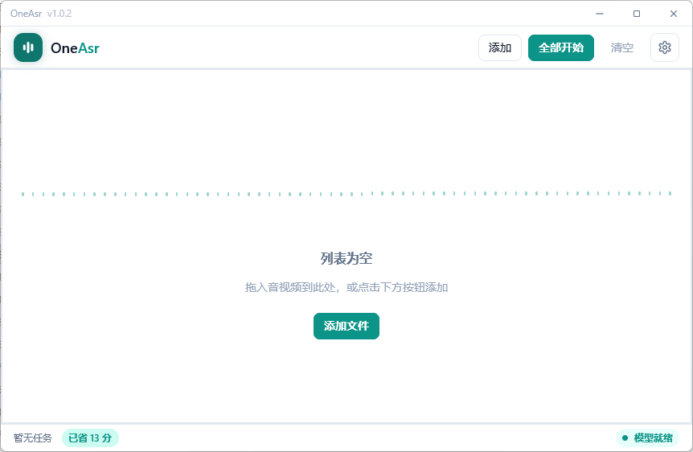
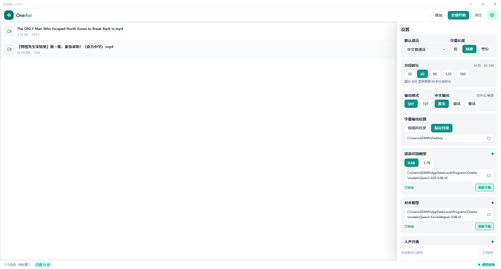

<div align="center">
  <h1>OneAsr</h1>
  <p>本地 · 离线 · 批量音视频 → SRT / TXT 字幕</p>
  <p>Windows / Linux / macOS · 基于 Qwen3-ASR + ForcedAligner · 不上传云端</p>

  [下载安装](#下载安装) · [快速上手](#快速上手) · [界面预览](#界面预览) · [CLI 命令行](#cli-命令行) · [Release](https://github.com/eclipse005/OneAsr/releases)
</div>

```text
音视频 → [人声分离] → VAD 分段 → 识别 → 对齐打轴 → 智能断句 → *.srt / *.txt
```

## 下载安装

当前版本 **[v1.1.0](https://github.com/eclipse005/OneAsr/releases/tag/v1.1.0)**（点文件名即下载）：

| 平台 | 下载 |
|------|------|
| Windows | [安装包](https://github.com/eclipse005/OneAsr/releases/download/v1.1.0/OneAsr_1.1.0_windows_setup.exe) · [便携包](https://github.com/eclipse005/OneAsr/releases/download/v1.1.0/OneAsr_1.1.0_windows_portable.zip) |
| Linux x64 | [安装包](https://github.com/eclipse005/OneAsr/releases/download/v1.1.0/OneAsr_1.1.0_linux_x64.deb) · [便携包](https://github.com/eclipse005/OneAsr/releases/download/v1.1.0/OneAsr_1.1.0_linux_x64.tar.gz) |
| macOS（M 芯片） | [磁盘映像](https://github.com/eclipse005/OneAsr/releases/download/v1.1.0/OneAsr_1.1.0_macos.dmg) |

## 快速上手

1. 运行主程序（Windows `oneasr.exe`，Linux / macOS `oneasr`）
2. **设置** → 下载 **ASR**（建议先 0.6B）+ **ForcedAligner**（必需）
3. 选好源语言 → 添加音视频 → 开始
4. 输出目录拿同名 `.srt`

## 界面预览

主界面空态与任务列表 + 设置抽屉（并排同一尺寸）：

| 主界面（空态） | 任务列表与设置 |
|---|---|
|  |  |

## 功能

- **完全本地**：识别与对齐都在本机，下完模型可断网用
- **批量队列**：一次丢多个文件，进度与阶段一目了然
- **时间轴可靠**：ForcedAligner 词级对齐 + 智能断句，不是整段估时间
- **11 种语言**：中文普通话、English、粤语、日本語、한국어、Français、Deutsch、Italiano、Español、Português、Русский（需手动指定，不自动检测）
- **双规格 ASR**：0.6B（更快 / 省显存）· 1.7B（更准 / 更吃资源）
- **输出可选**：SRT / TXT 可同时选，默认与视频同目录
- **简繁可选**：原文 / 简体 / 繁体（仅中文、粤语生效，不影响时间轴）
- **人声分离（可选）**：内置 HTDemucs v4，带 BGM / 噪声时先压掉背景音
- **GPU 加速**：NVIDIA / AMD / Intel / Mac M 芯片；无独显自动走 CPU

## 模型与体积

安装包**不含**权重，首次在设置里从 ModelScope 下载（可断点续传）：

| 组件 | 约体积 | 说明 |
|------|--------|------|
| Qwen3-ASR-0.6B-hf | ~1.6 GB | 默认推荐 |
| Qwen3-ASR-1.7B-hf | ~4.1 GB | 更高精度 |
| Qwen3-ForcedAligner-0.6B-hf | ~1.8 GB | 必需，所有 ASR 共用 |
| HTDemucs v4 人声权重 | ~84 MB | 可选 |

常用组合约 3.5～6.0 GB。仅下模型需要联网，识别过程可离线。

## CLI 命令行

安装包自带 `oneasr-cli`（与 GUI 同一条流水线），先用 GUI 下好模型再调用：

```powershell
oneasr-cli.exe transcribe --input "video.mp4" --language zh --backend auto --output "out.srt"
```

`--txt` 额外出 txt、`--script original|simplified|traditional` 切中文字形、`--vocal-separation` 先做人声分离。`--help` 看完整参数。

## 配置要求

- 系统：Windows 10 / 11、Linux、macOS（Apple Silicon）
- 显卡：0.6B 推荐 4GB+ 显存，1.7B 建议 6GB+；无独显走 CPU（慢但可用）
- 网络：仅首次下载模型需要

## 提示

- **语种选错**是最常见的翻车原因；粤语选「粤语」，其他中文方言一般选「中文普通话」
- 带 BGM / 噪声先开「人声分离」，准得多
- macOS 包未签名：dmg 里有「安装 OneAsr.command」+「安装说明.txt」，按说明装一次即可
- Linux 建议把 tar.gz 解压到用户目录
- Linux 便携包首次使用运行 `bash install-desktop.sh`，注册应用图标和启动器（Linux 不会把图标嵌入 ELF 可执行文件）

## 致谢

首发与交流：[LINUX DO](https://linux.do/) · [吾爱破解](https://www.52pojie.cn/) · [小众软件论坛](https://meta.appinn.net/)

## 许可

- 本项目代码：**MIT**
- 模型权重与协议以 [Qwen3-ASR](https://github.com/QwenLM/Qwen3-ASR) 及对应托管方为准
- 引擎：[qwen3-asr-wgpu](https://github.com/eclipse005/qwen3-asr-wgpu) · [qwen3-aligner-wgpu](https://github.com/eclipse005/qwen3-aligner-wgpu) · [demucs-wgpu](https://github.com/eclipse005/demucs-wgpu)

<p align="center">
  <sub>问题反馈请附系统版本、显卡与显存、所用模型（0.6B / 1.7B）与报错信息</sub>
</p>
