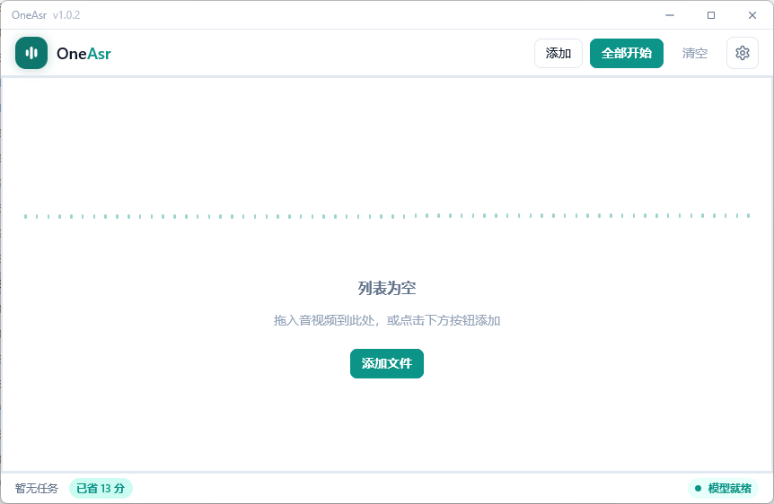
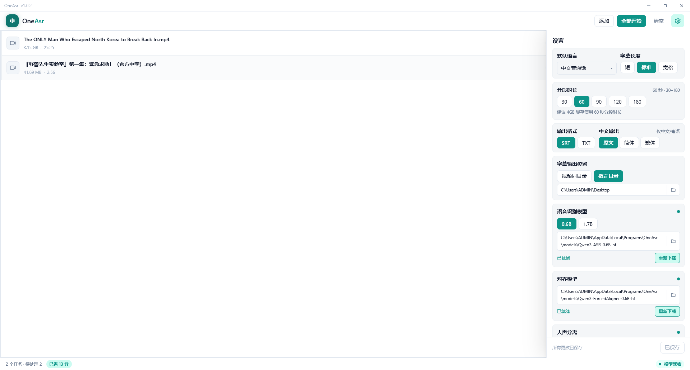

<div align="center">
  <h1>OneAsr</h1>
  <p>Local · Offline · Batch audio/video → SRT / ASS / TXT subtitles</p>
  <p>Windows / Linux / macOS · Built on Qwen3-ASR · Nothing leaves your machine</p>

  [Download](#download) · [Quick start](#quick-start) · [Screenshots](#screenshots) · [CLI](#cli) · [Release](https://github.com/eclipse005/OneAsr/releases)

  **English** · [简体中文](README.zh-CN.md)
</div>

<table width="100%">
  <tr>
    <td width="50%" valign="top">
      <p><strong>01 · TRANSCRIBE</strong></p>
      <h3>Make subtitles from audio or video</h3>
      <p><strong>Input</strong> · audio or video</p>
      <p align="center">
        <code>Audio/video</code> → <code>VAD</code> → <code>Qwen3-ASR</code><br>
        ↓<br>
        <code>CTC alignment</code> → <code>Smart segmentation</code>
      </p>
      <p>Optional vocal separation runs before speech is segmented and transcribed.</p>
      <p><strong>Output</strong> · SRT / ASS / TXT</p>
    </td>
    <td width="50%" valign="top">
      <p><strong>02 · ALIGN A SCRIPT</strong></p>
      <h3>Add timings to an existing script</h3>
      <p><strong>Input</strong> · audio/video + a checked .txt / .srt</p>
      <p align="center">
        <code>Audio/video</code> + <code>Transcript</code><br>
        ↓<br>
        <code>Forced alignment</code><br>
        ↓<br>
        <code>Timed subtitle lines</code>
      </p>
      <p>Optional vocal separation runs first. Recognition is skipped; the original wording is kept.</p>
      <p><strong>Output</strong> · SRT / ASS</p>
    </td>
  </tr>
</table>

## Download

Current version **[v1.2.3](https://github.com/eclipse005/OneAsr/releases/tag/v1.2.3)** (click a file name to download):

| Platform | Download |
|------|------|
| Windows | [Installer](https://github.com/eclipse005/OneAsr/releases/download/v1.2.3/OneAsr_1.2.3_windows_setup.exe) · [Portable](https://github.com/eclipse005/OneAsr/releases/download/v1.2.3/OneAsr_1.2.3_windows_portable.zip) |
| Linux x64 | [.deb](https://github.com/eclipse005/OneAsr/releases/download/v1.2.3/OneAsr_1.2.3_linux_x64.deb) · [Portable](https://github.com/eclipse005/OneAsr/releases/download/v1.2.3/OneAsr_1.2.3_linux_x64.tar.gz) |
| macOS (Apple Silicon) | [Disk image](https://github.com/eclipse005/OneAsr/releases/download/v1.2.3/OneAsr_1.2.3_macos.dmg) |

## Quick start

1. Run the app (`oneasr.exe` on Windows, `oneasr` on Linux / macOS)
2. **Settings** → download the **ASR** model (0.6B recommended first) + an **aligner** (required)
3. Pick the source language → add audio/video → Start
4. Grab the matching `.srt` from the output folder
5. Already have a verified script? Pick it together with the media and Start — recognition is skipped and your lines are aligned directly (output: `video.aligned.srt`; enable SRT or ASS in Settings first)

## Screenshots

Main window (empty state) and the task list + settings drawer (same window size, side by side):

| Main window (empty state) | Tasks & settings |
|---|---|
|  |  |

## Features

- **Fully local**: transcription and alignment run on your machine; after the models are downloaded you can go offline
- **Batch queue**: drop in many files at once; progress and stage are always visible
- **Reliable timing**: CTC word-level alignment + smart sentence segmentation — not whole-segment guesses
- **Transcript matching**: already have a verified script? Attach it and recognition is skipped entirely — every line gets a real timestamp, so no more fixing mis-heard words you already know the answer to
- **ASS karaoke output**: CJK characters (words in spaced languages) each carry their own timing for player highlighting
- **CTC aligner (default)**: omniASR-CTC-300M-v2 — frame-synchronous and 100% local, no language coverage limits
- **Legacy forced aligner**: Qwen3-ForcedAligner-0.6B-hf is still selectable in Settings if you prefer it
- **11 source languages**: 中文普通话, English, 粤语, 日本語, 한국어, Français, Deutsch, Italiano, Español, Português, Русский (set manually per task; no auto-detection)
- **Two ASR sizes**: 0.6B (faster / less VRAM) · 1.7B (more accurate / more resources)
- **Output options**: SRT / ASS / TXT, in any combination; saved next to the video by default
- **Chinese script choice**: original / Simplified / Traditional (Chinese & Cantonese only; timing is unaffected)
- **Vocal separation (optional)**: built-in HTDemucs v4 strips BGM / noise before transcribing
- **GPU acceleration**: NVIDIA / AMD / Intel / Apple Silicon; falls back to CPU automatically when no discrete GPU is present

## Models & sizes

The installer ships **no** weights; models download from ModelScope on first use (resumable):

| Component | Approx. size | Notes |
|------|--------|------|
| Qwen3-ASR-0.6B-hf | ~1.6 GB | Default recommendation |
| Qwen3-ASR-1.7B-hf | ~4.1 GB | Higher accuracy |
| omniASR-CTC-300M-v2-hf | ~1.3 GB | Required, shared by all ASR sizes |
| Qwen3-ForcedAligner-0.6B-hf | ~1.8 GB | Optional — only if you switch the aligner |
| HTDemucs v4 vocal weights | ~84 MB | Optional |

Common setups total about 2.9–5.4 GB. Only the model download needs network; transcription itself runs offline.

## CLI

The installer ships `oneasr-cli` (same pipeline as the GUI). Download the models via the GUI first, then:

```powershell
oneasr-cli.exe transcribe --input "video.mp4" --language zh --backend auto --output "out.srt"
```

`align` attaches a transcript (`--text script.txt`) and stamps it with timestamps without recognition; `render` re-renders a saved `timeline.json` into another preset without loading any models. `--txt` also writes a text transcript, `--script original|simplified|traditional` switches the Chinese glyph set, `--vocal-separation` separates vocals first. See `--help` for all options.

## Requirements

- OS: Windows 10 / 11, Linux, macOS (Apple Silicon)
- GPU: 4 GB+ VRAM recommended for 0.6B, 6 GB+ for 1.7B; CPU works without a discrete GPU (slower but usable)
- Network: only for the first model download
- ffmpeg: already bundled in every release. **Building from source?** Either way works — unpack the
  matching archive from [ffmpeg 7.1.2](https://github.com/Tyrrrz/FFmpegBin/releases/tag/7.1.2) and
  drop `ffmpeg.exe` (Windows) or `ffmpeg` (Linux / macOS) into `bin/`; or do nothing at all if ffmpeg
  is already installed system-wide (the app uses the copy in `bin/` first, then the one on `PATH`)

## Tips

- **Picking the wrong source language** is the most common failure; choose 粤语 for Cantonese, and 中文普通话 for other Chinese dialects
- With heavy BGM / noise, turn on vocal separation first — accuracy improves a lot
- The macOS build is unsigned: the DMG includes 安装 OneAsr.command + 安装说明.txt; follow the notes — the Terminal method is listed first and works on every macOS version
- On Linux, extract the tar.gz into your home folder
- On Linux, run `bash install-desktop.sh` from the portable package on first use — it registers the app icon and launcher (Linux does not embed icons in ELF executables)

## Community

Announced and discussed at: [LINUX DO](https://linux.do/) · [52pojie](https://www.52pojie.cn/) · [Appinn forums](https://meta.appinn.net/)

## License

- This project's code: **MIT**
- Model weights and their terms follow [Qwen3-ASR](https://github.com/QwenLM/Qwen3-ASR) and their hosts
- Engines: [qwen3-asr-wgpu](https://github.com/eclipse005/qwen3-asr-wgpu) · [ctc-forced-aligner-wgpu](https://github.com/eclipse005/ctc-forced-aligner-wgpu) · [qwen3-aligner-wgpu](https://github.com/eclipse005/qwen3-aligner-wgpu) · [demucs-wgpu](https://github.com/eclipse005/demucs-wgpu)

## Star History

[](https://star-history.com/#eclipse005/OneAsr&Date)

<p align="center">
  <sub>When reporting an issue, please include your OS version, GPU & VRAM, the model used (0.6B / 1.7B) and the error message</sub>
</p>
